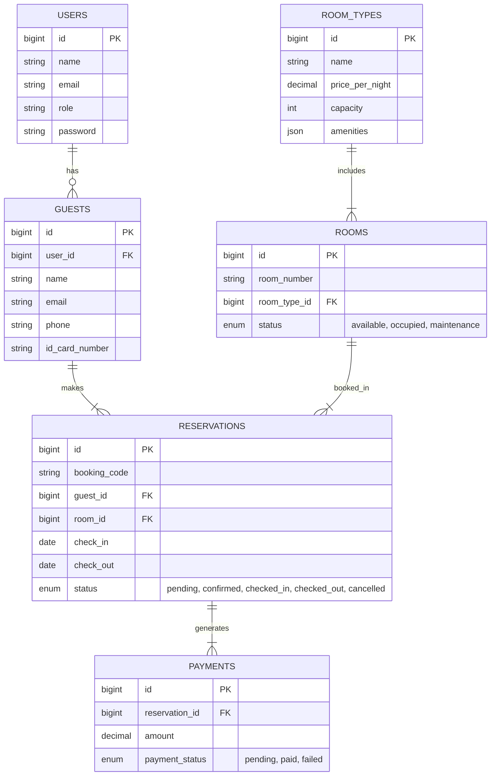

# 🏨 Hotel Management System (Sistem Manajemen Hotel)

Selamat datang di dokumentasi resmi untuk **Hotel Management System**. Proyek ini adalah solusi berbasis web yang komprehensif, dirancang untuk memudahkan operasional hotel mulai dari pemesanan kamar oleh tamu hingga pengelolaan administrasi oleh staf hotel. Dibangun dengan framework **Laravel 10**, sistem ini menawarkan keandalan, keamanan, dan kemudahan penggunaan.

---

## 📋 Daftar Isi

1. [Tentang Proyek](#-tentang-proyek)
2. [Keunggulan & Fitur Utama](#-keunggulan--fitur-utama)
    - [Fitur Tamu (Guest)](#fitur-tamu-guest)
    - [Fitur Admin & Resepsionis](#fitur-admin--resepsionis)
3. [Arsitektur Sistem](#-arsitektur-sistem)
    - [Teknologi yang Digunakan](#teknologi-yang-digunakan)
    - [Struktur Direktori](#struktur-direktori)
    - [Alur Kerja Sistem (System Flow)](#alur-kerja-sistem-system-flow)
4. [Dokumentasi Database](#-dokumentasi-database)
    - [Skema Database (ERD)](#skema-database-erd)
    - [Kamus Data (Data Dictionary)](#kamus-data-data-dictionary)
5. [Logika Bisnis & Controller](#-logika-bisnis--controller)
6. [Panduan Instalasi](#-panduan-instalasi)
7. [Panduan Penggunaan](#-panduan-penggunaan)
8. [API Endpoints](#-api-endpoints)
9. [Troubleshooting](#-troubleshooting)
10. [Kontribusi](#-kontribusi)

---

## 📖 Tentang Proyek

**Hotel Management System** dibuat untuk mendigitalisasi proses bisnis perhotelan. Sistem  ini mengatasi masalah pencatatan manual yang rentan kesalahan dan lambat. Dengan sistem ini, hotel dapat:
*   Meningkatkan efisiensi kerja staf resepsionis.
*   Memberikan pengalaman pemesanan yang mulus bagi tamu (booking engine).
*   Melacak pendapatan dan status kamar secara *real-time*.
*   Mengelola data tamu dan riwayat kunjungan dengan aman.

Proyek ini sangat cocok digunakan untuk hotel skala kecil hingga menengah, wisma, atau guesthouse yang ingin beralih ke sistem manajemen modern.

---

## 🌟 Keunggulan & Fitur Utama

Sistem ini dirancang dengan memisahkan hak akses menjadi tiga peran utama: **Admin**, **Receptionist**, dan **Guest**.

### Fitur Tamu (Guest)
Tamu adalah pengguna publik yang mengakses situs web hotel.
1.  **Pencarian Kamar (Room Search)**:
    -   Tamu dapat mencari ketersediaan kamar berdasarkan tanggal *check-in* dan *check-out*.
    -   Filter berdasarkan tipe kamar.
    -   Informasi detail fasilitas kamar.
2.  **Pemesanan Online (Booking Engine)**:
    -   Alur pemesanan yang mudah dan intuitif.
    -   Formulir data diri lengkap.
    -   Validasi ketersediaan kamar secara *real-time* sebelum pembayaran.
3.  **Manajemen Pemesanan (My Bookings)**:
    -   Tamu yang terdaftar dapat melihat riwayat pemesanan mereka.
    -   Melihat status pembayaran dan status reservasi.
    -   Mencetak bukti pemesanan.
    -   Membatalkan pesanan (jika kebijakan mengizinkan).
4.  **Autentikasi Aman**:
    -   Login dan Registrasi akun untuk menyimpan data tamu agar tidak perlu mengisi ulang saat memesan kembali.

### Fitur Admin & Resepsionis
Staf hotel memiliki panel khusus (`/admin`) untuk mengelola operasional.
1.  **Dashboard Informatif**:
    -   Ringkasan jumlah kamar tersedia, terisi, dan sedang *maintenance*.
    -   Grafik pendapatan bulanan.
    -   Daftar tamu yang akan *check-in* dan *check-out* hari ini.
2.  **Manajemen Kamar (Room Management)**:
    -   CRUD (Create, Read, Update, Delete) Data Kamar.
    -   Pengaturan Nomor Kamar, Lantai, dan Tipe Kamar.
    -   Status Kamar: *Available*, *Occupied*, *Maintenance*.
3.  **Manajemen Tipe Kamar (Room Types)**:
    -   Mengatur kategori kamar (Standard, Deluxe, Suite, dll).
    -   Menetapkan harga per malam.
    -   Mengelola daftar fasilitas (Amenities) dalam format JSON.
    -   Upload foto kamar.
4.  **Operasional Reservasi (Front Desk)**:
    -   **Check-In**: Memproses kedatangan tamu, mengubah status kamar menjadi *Occupied*.
    -   **Check-Out**: Memproses keberangkatan tamu, mengubah status kamar menjadi *Available*.
    -   Melihat detail pesanan, termasuk permintaan khusus (*special requests*).
5.  **Manajemen Pembayaran**:
    -   Memverifikasi status pembayaran tamu.
    -   Mencatat metode pembayaran (Cash, Transfer, Credit Card, dll).
6.  **Laporan Tamu**:
    -   Melihat database seluruh tamu yang pernah menginap.
    -   Detail kontak dan riwayat menginap.

---

## 🏗 Arsitektur Sistem

### Teknologi yang Digunakan
Sistem ini dibangun di atas fondasi teknologi yang kokoh dan modern:
*   **Backend Framework**: [Laravel 10.x](https://laravel.com) - Framework PHP terpopuler yang dikenal dengan sintaksis elegan dan keamanan tinggi.
*   **Bahasa Pemrograman**: PHP 8.1+
*   **Database**: MySQL / MariaDB - Untuk penyimpanan data relasional yang handal.
*   **Frontend**: Blade Templating Engine (bawaan Laravel) dengan styling CSS kustom (Vanilla CSS) untuk performa dan fleksibilitas desain tanpa ketergantungan framework CSS berat.
*   **Server**: Apache / Nginx.

### Struktur Direktori
Berikut adalah penjelasan struktur direktori penting dalam proyek ini:

```
/
├── app/
│   ├── Http/
│   │   ├── Controllers/       # Logika bisnis aplikasi
│   │   │   ├── Admin/         # Controller khusus Admin (Dashboard, Room, dll)
│   │   │   ├── Guest/         # Controller untuk Tamu (Booking, Search, dll)
│   │   │   └── Auth/          # Logika Autentikasi
│   │   ├── Middleware/        # Filter request (Cek Role, Auth)
│   ├── Models/                # Representasi tabel database (Eloquent ORM)
├── database/
│   ├── migrations/            # Skema versi database (version control untuk DB)
│   ├── seeders/               # Data awal untuk pengujian/inisialisasi
├── resources/
│   ├── views/                 # Tampilan antarmuka (Blade Templates)
│   │   ├── admin/             # View panel admin
│   │   ├── guest/             # View halaman publik
│   │   └── layouts/           # Template utama (header, footer, sidebar)
├── routes/
│   ├── web.php                # Definisi rute URL aplikasi
├── public/                    # Aset publik (CSS, JS, Images)
└── .env                       # Konfigurasi environment (Database, App Key)
```

### Alur Kerja Sistem (System Flow)

#### 1. Alur Pemesanan Kamar (Guest Flow)
1.  **Pencarian**: Tamu mengakses halaman utama, memasukkan tanggal *check-in* dan *check-out*.
2.  **Validasi Ketersediaan**:
    *   Sistem (`RoomSearchController`) mencari kamar di tabel `rooms`.
    *   Mengecek apakah kamar tersebut sudah ada di tabel `reservations` pada rentang tanggal yang dipilih.
    *   Kamar yang statusnya 'maintenance' otomatis dikeluarkan dari hasil.
3.  **Pemilihan Kamar**: Tamu melihat daftar kamar yang tersedia beserta harganya yang dihitung (`harga per malam * durasi malam`).
4.  **Pengisian Data**: Tamu mengisi form booking. Jika sudah login, data terisi otomatis.
5.  **Proses Booking (`BookingController@store`)**:
    *   Validasi input.
    *   **Double Check Availability**: Memastikan kamar belum diambil orang lain di detik yang sama.
    *   **Transaksi Database**:
        1.  Insert/Update data `guests`.
        2.  Insert data `reservations` (Status: Pending).
        3.  Insert data `payments` (Status: Pending).
6.  **Konfirmasi**: Tamu diarahkan ke halaman sukses dan mendapatkan Kode Booking.

#### 2. Alur Check-In (Receptionist Flow)
1.  Tamu datang ke resepsionis menunjukkan Kode Booking atau KTP.
2.  Resepsionis mencari data di menu Reservations.
3.  Verifikasi pembayaran. Jika lunas, status pembayaran diupdate.
4.  Resepsionis menekan tombol **Check-In**.
5.  **Sistem Update**:
    *   Status Reservation -> `checked_in`.
    *   Status Room -> `occupied` (agar tidak bisa dibooking orang lain secara walk-in).
6.  Kunci kamar diserahkan.

#### 3. Alur Check-Out (Receptionist Flow)
1.  Tamu mengembalikan kunci.
2.  Resepsionis menekan tombol **Check-Out**.
3.  **Sistem Update**:
    *   Status Reservation -> `checked_out`.
    *   Status Room -> `available` (siap dipesan kembali).

---

## 💾 Dokumentasi Database

Database menggunakan mesin **InnoDB** untuk mendukung relasi (Foreign Keys) dan transaksi data (ACID compliance). Nama database default: `hotel`.

### Visualisasi Relasi (ERD)



### Kamus Data (Data Dictionary)

Berikut adalah detail struktur setiap tabel dalam database.

#### 1. Tabel `users`
Menyimpan data akun pengguna untuk login ke sistem.
| Kolom | Tipe Data | Deskripsi | Aturan |
| :--- | :--- | :--- | :--- |
| `id` | BIGINT (PK) | Primary Key | Auto Increment |
| `name` | VARCHAR(255) | Nama lengkap pengguna | Not Null |
| `email` | VARCHAR(255) | Email login | Unique, Not Null |
| `role` | ENUM | Peran pengguna | 'admin', 'receptionist', 'guest' (Default: 'guest') |
| `password` | VARCHAR(255) | Password terenkripsi (Bcrypt) | Not Null |
| `created_at` | TIMESTAMP | Waktu pembuatan akun | Nullable |
| `updated_at` | TIMESTAMP | Waktu update terakhir | Nullable |

#### 2. Tabel `guests`
Menyimpan data profil tamu yang melakukan reservasi. Dipisah dari user untuk memungkinkan reservasi oleh admin tanpa akun user (walk-in).
| Kolom | Tipe Data | Deskripsi | Aturan |
| :--- | :--- | :--- | :--- |
| `id` | BIGINT (PK) | Primary Key | Auto Increment |
| `user_id` | BIGINT (FK) | Relasi ke tabel users (jika ada) | Nullable, On Delete Set Null |
| `name` | VARCHAR(255) | Nama tamu sesuai KTP | Not Null |
| `email` | VARCHAR(255) | Email kontak | Not Null |
| `phone` | VARCHAR(255) | Nomor HP | Not Null |
| `id_card_number` | VARCHAR(255) | Nomor KTP / Paspor | Nullable |
| `address` | TEXT | Alamat domisili | Nullable |

#### 3. Tabel `room_types`
Mendefinisikan kategori kamar.
| Kolom | Tipe Data | Deskripsi | Aturan |
| :--- | :--- | :--- | :--- |
| `id` | BIGINT (PK) | Primary Key | Auto Increment |
| `name` | VARCHAR(255) | Nama tipe (contoh: Deluxe) | Not Null |
| `description` | TEXT | Deskripsi kamar | Nullable |
| `price_per_night` | DECIMAL(12,2) | Harga per malam | Not Null |
| `capacity` | INT | Kapasitas orang | Default: 2 |
| `amenities` | JSON | Fasilitas (Wifi, TV, AC) | Disimpan sebagai Array JSON |
| `image` | VARCHAR(255) | Path gambar kamar | Nullable |

#### 4. Tabel `rooms`
Menyimpan unit fisik kamar yang nyata.
| Kolom | Tipe Data | Deskripsi | Aturan |
| :--- | :--- | :--- | :--- |
| `id` | BIGINT (PK) | Primary Key | Auto Increment |
| `room_number` | VARCHAR(255) | Nomor Kamar (contoh: 101) | Unique |
| `room_type_id` | BIGINT (FK) | Relasi ke tipe kamar | Not Null, On Delete Cascade |
| `floor` | INT | Lokasi lantai | Default: 1 |
| `status` | ENUM | Status fisik kamar | 'available', 'occupied', 'maintenance' |

#### 5. Tabel `reservations`
Tabel inti yang mencatat transaksi pemesanan.
| Kolom | Tipe Data | Deskripsi | Aturan |
| :--- | :--- | :--- | :--- |
| `id` | BIGINT (PK) | Primary Key | Auto Increment |
| `booking_code` | VARCHAR(255) | Kode unik booking (generated) | Unique, Not Null |
| `guest_id` | BIGINT (FK) | Relasi ke tamu | Not Null |
| `room_id` | BIGINT (FK) | Relasi ke kamar | Not Null |
| `check_in` | DATE | Tanggal masuk | Not Null |
| `check_out` | DATE | Tanggal keluar | Not Null |
| `total_guests` | INT | Jumlah tamu menginap | Default: 1 |
| `status` | ENUM | Status proses reservasi | 'pending', 'confirmed', 'checked_in', 'checked_out', 'cancelled' |
| `total_price` | DECIMAL(12,2) | Total tagihan | Not Null |
| `special_requests`| TEXT | Permintaan khusus | Nullable |

#### 6. Tabel `payments`
Mencatat status pembayaran untuk setiap reservasi.
| Kolom | Tipe Data | Deskripsi | Aturan |
| :--- | :--- | :--- | :--- |
| `id` | BIGINT (PK) | Primary Key | Auto Increment |
| `reservation_id` | BIGINT (FK) | Relasi ke reservasi | Not Null, On Delete Cascade |
| `amount` | DECIMAL(12,2) | Jumlah yang dibayarkan | Not Null |
| `payment_method` | ENUM | Metode bayar | 'cash', 'credit_card', 'transfer', etc |
| `payment_status` | ENUM | Status transaksi | 'pending', 'paid', 'failed', 'refunded' |

---

## 🧠 Logika Bisnis & Controller

Bagian ini menjelaskan secara rinci bagaimana kode PHP menangani logika bisnis yang kompleks di sistem ini. Memahami bagian ini sangat penting bagi pengembang yang ingin memodifikasi sistem.

### 1. BookingController (`App\Http\Controllers\Guest\BookingController`)
Controller ini adalah jantung dari proses reservasi tamu.
*   **Method `create($request, $roomTypeId)`**:
    *   Tujuan: Menampilkan halaman form booking.
    *   Logika: Menerima tanggal *check-in/out* dari query string. Mengambil daftar kamar (`rooms`) yang `room_type_id` sesuai dan statusnya `available`. Kemudian melakukan filter lebih lanjut menggunakan method model `isAvailable()` untuk memastikan tidak ada konflik tanggal reservasi. Jika tidak ada kamar, redirect kembali dengan pesan error. Menghitung total harga.
*   **Method `store(Request $request)`**:
    *   Tujuan: Memproses submit form booking.
    *   Logika:
        1.  Validasi input sangat ketat (format email, tanggal check-in tidak boleh masa lalu, check-out harus setelah check-in).
        2.  **Concurrency Check**: Melakukan pengecekan ulang `isAvailable()` tepat sebelum menyimpan, untuk mencegah *race condition* (dua orang booking kamar yang sama di detik yang sama).
        3.  **Database Transaction (`DB::beginTransaction`)**: Penting! Operasi insert ke tabel `guests`, `reservations`, dan `payments` dibungkus dalam satu transaksi. Jika salah satu gagal, semua dibatalkan (`rollback`) untuk menjaga integritas data.
        4.  Redirect ke halaman sukses.

### 2. ReservationController (`App\Http\Controllers\Admin\ReservationController`)
Mengelola reservasi dari sisi Admin.
*   **Method `index(Request $request)`**:
    *   Fitur Pencarian: Mendukung pencarian berdasarkan Booking Code, Nama Tamu, atau Email. Menggunakan *Eager Loading* (`with(['guest', ...])`) untuk mencegah masalah N+1 Query dan meningkatkan performa loading halaman admin.
*   **Method `checkin(Reservation $reservation)`**:
    *   Logika: Mengubah status `reservations.status` menjadi 'checked_in' DAN secara otomatis mengubah `rooms.status` menjadi 'occupied'. Ini sinkronisasi otomatis agar kamar terlihat penuh di sistem.
*   **Method `checkout(Reservation $reservation)`**:
    *   Logika: Mengubah status `reservations.status` menjadi 'checked_out' DAN mengembalikan `rooms.status` menjadi 'available'. Kamar siap dijual kembali.

### 3. Room Logic (`App\Models\Room`)
*   **Method `isAvailable($start, $end)`**:
    *   Ini adalah *custom method* di Model.
    *   Logika: Mengecek relasi `reservations()` milik kamar tersebut. Menggunakan query SQL `where` untuk mencari apakah ada reservasi lain yang rentang tanggalnya beririsan (*overlap*) dengan `$start` dan `$end` yang diminta.
    *   Return: `True` jika kosong (aman), `False` jika ada tabrakan jadwal.

---

## 🚀 Panduan Instalasi

Ikuti langkah-langkah ini untuk menjalankan proyek di komputer lokal Anda (Localhost).

### Prasyarat System
Pastikan komputer Anda sudah terinstall:
1.  **PHP** >= 8.1 (Pastikan ekstensi `pdo_mysql`, `mbstring`, `openssl` aktif).
2.  **Composer** (Dependency Manager untuk PHP).
3.  **MySQL** atau **MariaDB** Database Server (bisa via XAMPP/Laragon).
4.  **Git** (Opsional, untuk clone repo).

### Langkah Instalasi

1.  **Clone Repository** (atau ekstrak file zip)
    ```bash
    git clone https://github.com/username/hotel-management.git
    cd hotel-management
    ```

2.  **Install Dependensi PHP**
    Jalankan perintah ini di terminal (Command Prompt/Powershell) di dalam folder proyek:
    ```bash
    composer install
    ```
    *Tunggu hingga proses download selesai.*

3.  **Konfigurasi Environment**
    Salin file contoh konfigurasi `.env.example` menjadi `.env`:
    ```bash
    cp .env.example .env
    ```
    Atau di Windows (CMD):
    ```cmd
    copy .env.example .env
    ```

4.  **Generate App Key**
    ```bash
    php artisan key:generate
    ```

5.  **Konfigurasi Database**
    Buka file `.env` dengan text editor (Notepad/VS Code). Cari bagian berikut dan sesuaikan dengan setting database lokal Anda. Jika menggunakan XAMPP default, password biasanya kosong.
    ```env
    DB_CONNECTION=mysql
    DB_HOST=127.0.0.1
    DB_PORT=3306
    DB_DATABASE=hotel      <-- Pastikan nama ini sesuai
    DB_USERNAME=root       <-- User default XAMPP
    DB_PASSWORD=           <-- Kosongkan jika default
    ```

6.  **Buat Database**
    Buka phpMyAdmin (http://localhost/phpmyadmin) atau terminal MySQL, dan buat database baru dengan nama `hotel`.
    ```sql
    CREATE DATABASE hotel;
    ```

7.  **Migrasi & Seeding Database**
    Perintah ini akan membuat tabel-tabel dan mengisi data dummy (User admin, contoh kamar, dll) agar aplikasi siap pakai.
    ```bash
    php artisan migrate --seed
    ```
    *Jika Anda memiliki file `hotel.sql`, Anda juga bisa mengimportnya via phpMyAdmin sebagai alternatif langkah ini.*

8.  **Jalankan Server Lokal**
    ```bash
    php artisan serve
    ```
    Aplikasi akan berjalan di `http://127.0.0.1:8000`.

---

## 📖 Panduan Penggunaan

### Login Akun
Akses halaman login di `http://127.0.0.1:8000/login`.

#### Akun Demo (Default Seeders):
*   **Administrator**:
    *   Email: `admin@hotel.com` (atau cek di database tabel users role admin)
    *   Pass: `password`
*   **Resepsionis**:
    *   Email: `receptionist@hotel.com`
    *   Pass: `password`
*   **Tamu (Guest)**:
    *   Bisa register baru.

### Skenario Penggunaan Admin
1.  **Menambah Tipe Kamar Baru**:
    *   Login sebagai Admin.
    *   Navigasi ke menu "Room Types".
    *   Klik "Add New". Isi nama (misal: "Presidential Suite"), harga, deskripsi.
    *   Simpan.
2.  **Menambah Unit Kamar**:
    *   Di menu "Rooms", klik "Add New".
    *   Pilih Tipe Kamar yang baru dibuat.
    *   Isi nomor kamar (misal: 909) dan lantai.
    *   Simpan.

### Skenario Penggunaan Tamu
1.  Buka Halaman Utama.
2.  Pilih tanggal check-in (besok) dan check-out (lusa). Klik "Cari Kamar".
3.  Pilih kamar yang diinginkan, klik "Book Now".
4.  Login atau isi data diri.
5.  Konfirmasi pemesanan.
6.  Simpan Kode Booking yang muncul.

---

## 🔗 API Endpoints

Meskipun aplikasi ini adalah Monolith (Server-side rendering), berikut adalah representasi rute internal yang bertindak sebagai endpoint logika.

| Method | Endpoint | Deskripsi | Akses |
| :--- | :--- | :--- | :--- |
| `GET` | `/` | Halaman Home | Public |
| `GET` | `/rooms` | Pencarian & Filter Kamar | Public |
| `GET` | `/login` | Form Login | Guest |
| `POST` | `/booking` | Submit Data booking | Auth Guest |
| `GET` | `/admin/dashboard` | Statistik Hotel | Admin/Recep |
| `GET` | `/admin/reservations` | List Reservasi | Admin/Recep |
| `POST` | `/admin/reservations/{id}/checkin` | Proses Check-In | Admin/Recep |
| `POST` | `/admin/reservations/{id}/checkout` | Proses Check-Out | Admin/Recep |

---

## 🔧 Troubleshooting

Masalah yang sering terjadi dan solusinya:

#### 1. Error `Target class [Controller] does not exist`
*   **Penyebab**: Namespace controller tidak sesuai atau routing salah.
*   **Solusi**: Jalankan `php artisan route:clear` untuk membersihkan cache routing.

#### 2. Gambar tidak muncul
*   **Penyebab**: Symbolic link storage belum dibuat.
*   **Solusi**: Jalankan perintah `php artisan storage:link`. Pastikan folder `public/storage` terbentuk.

#### 3. Error Database (Connection Refused)
*   **Penyebab**: Credentials di `.env` salah atau MySQL belum jalan.
*   **Solusi**: Cek XAMPP Control Panel, pastikan MySQL Start (Hijau). Cek file `.env` pastikan password benar. Jalankan `php artisan config:clear`.

#### 4. Halaman Putih (Blank) atau Error 500
*   **Penyebab**: Permission folder storage salah atau error PHP.
*   **Solusi**:
    *   Cek file log di `storage/logs/laravel.log` untuk melihat detail error.
    *   Ubah permission folder: `chmod -R 777 storage bootstrap/cache` (di Linux/Mac).

---

## 🤝 Kontribusi

Kami sangat terbuka terhadap kontribusi! Jika Anda ingin menambahkan fitur atau memperbaiki bug:

1.  **Fork** repository ini.
2.  Buat branch baru: `git checkout -b fitur-baru`.
3.  Commit perubahan Anda: `git commit -m 'Menambah fitur pembayaran gateway'`.
4.  Push ke branch: `git push origin fitur-baru`.
5.  Buat **Pull Request** di GitHub.

---

**Dibuat dengan ❤️ untuk kemajuan industri perhotelan.**
*Versi Dokumentasi: 1.0.0*
